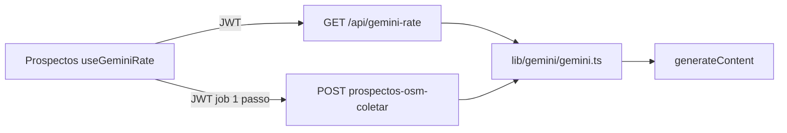

# IA no EmerLAB — guia do desenvolvedor

Contrato técnico do cliente Gemini (generateContent). Guia de produto: [ia-usuario.md](./ia-usuario.md). Modelo de ENV: [env.chaves.modelo](../env.chaves.modelo).

A chave **não pode** ir para o browser. A UI só lê status/rate via API; o cliente real vive no servidor e lê `GEMINI_*` / `PROSPECTOS_*`.

## Segurança

- Só no servidor: `GEMINI_API_KEY`, `GEMINI_MODEL`, `GEMINI_RPM`, `GEMINI_RPD`, `PROSPECTOS_*`.
- **Nunca** prefixo `VITE_` na chave (iria para o bundle).
- Chave em [aistudio.google.com/apikey](https://aistudio.google.com/apikey) (prefixos habituais `AIza…` ou `AQ.…`).
- API: **generateContent** (`@google/genai`). Não usamos Interactions API.

Onde gravar:

| Ambiente | Onde |
| --- | --- |
| Dev (Vite) | `.env.local` na raiz; reiniciar `npm run dev` |
| Produção Vercel | Environment Variables do projecto + redeploy |
| Supabase Edge (`VITE_SUPABASE_EDGE_API=true`) | `supabase/env.secrets` via `npm run supabase:secrets` — ver [env.secrets.example](../supabase/env.secrets.example) e [MIGRACAO_EDGE_FUNCTIONS.md](../supabase/MIGRACAO_EDGE_FUNCTIONS.md) |

## Módulo global

Ficheiro: [`src/lib/gemini/gemini.ts`](../src/lib/gemini/gemini.ts).

[`src/lib/credenciamento/geminiUpstream.js`](../src/lib/credenciamento/geminiUpstream.js) **só reexporta** (imports antigos não partem).

API (servidor):

| Função | Uso |
| --- | --- |
| `generateText` | Texto livre (uso interno / scripts) |
| `generateJson` | JSON + schema (coleta de prospectos) |
| `configSnapshot` | Estado local da chave/modelo — **não** pinge o Google |
| `lerRate` | RPM/RPD deste processo |
| `registarChamada` | Incrementa o contador após generateContent OK |
| `marcarRateEsgotado` | HTTP 429 → remaining 0 até retry |

Comportamento: timeout padrão **90s** (`GEMINI_TIMEOUT_MS`); logs `[gemini]`; sem `thinkingBudget: 0` (Gemini 3.x usa `thinkingLevel: MINIMAL` só se `desligarThinking`). Fallback de modelo em 404/503 via `GEMINI_MODEL_FALLBACK` e aliases.

## Variáveis de ambiente

| Tag | Padrão | Notas |
| --- | --- | --- |
| `GEMINI_API_KEY` | — | Obrigatória |
| `GEMINI_MODEL` | `gemini-3.5-flash-lite` | [Modelo](https://ai.google.dev/gemini-api/docs/models/gemini-3.5-flash-lite) |
| `GEMINI_MODEL_FALLBACK` | — | Opcional se o principal der 404 |
| `GEMINI_TIMEOUT_MS` | `90000` | Abort do generateContent |
| `GEMINI_RPM` | `15` | Pedidos/minuto (AI Studio) |
| `GEMINI_RPD` | `1000` | Pedidos/dia; reset à meia-noite **Pacific** |
| `PROSPECTOS_COLETA_FONTE` | `gemini` | `gemini` \| `osm` \| `auto` |
| `PROSPECTOS_GEMINI_FALLBACK_OSM` | `false` | Opt-in; na rota de prospectos deve ficar `false` |
| `PROSPECTOS_GEMINI_MAX` | `20` | Tecto no prompt e `slice(0, n)` |

[Rate limits oficiais](https://ai.google.dev/gemini-api/docs/rate-limits). A API **não** devolve `x-ratelimit-remaining` em HTTP 200.

## Rate (contador local)

O módulo conta as **nossas** chamadas neste processo contra `GEMINI_RPM` / `GEMINI_RPD`. Em 429, `remaining = 0` até `retry-after` / `RetryInfo`.

Limitação: em **várias instâncias Vercel** o contador não é global. Em `npm run dev` é fiável.

- `GET /api/gemini-rate` — [`api/gemini-rate.js`](../api/gemini-rate.js). JWT + `credenciamento.view` + ferramenta `credenciamento.prospectos_osm`.
- Resposta: `{ rpmUsados, rpmLimite, rpmRestantes, rpdUsados, rpdLimite, rpdRestantes, resetRpdIso, modelo }`.
- UI: [`src/hooks/useGemini.js`](../src/hooks/useGemini.js) (`useGeminiRate`) — a UI **não** fala com o Google. Chip em [`CredenciamentoProspectosOsm.jsx`](../src/pages/Credenciamento/Credenciamento_prospectos_osm/CredenciamentoProspectosOsm.jsx); recarrega após cada coleta.
- Dev Vite: plugin em [`vite.config.js`](../vite.config.js). Vercel: `api/gemini-rate.js` em [`vercel.json`](../vercel.json).

## Coleta de prospectos (só Gemini)

Sem Overpass nesta rota. Nominatim (pin no mapa) mantém-se.

- UI envia `fonte: 'gemini'`.
- Job: **1 passo**; falha Gemini = `failed` (não entra bounds/categorias OSM). [`prospectosColetaJob.js`](../src/lib/credenciamento/prospectosColetaJob.js), orquestrador [`prospectosColeta.js`](../src/lib/credenciamento/prospectosColeta.js).
- Prompt, schema e `slice(0, 20)`: [`prospectosGeminiColeta.js`](../src/lib/credenciamento/prospectosGeminiColeta.js) (`generateJson`, `timeoutMs: 90000`).
- POST `prospectos-osm-coletar` (`action: start` + `step`): [`api/prospectos-osm-coletar.js`](../api/prospectos-osm-coletar.js).

## Espelho Edge

Com `VITE_SUPABASE_EDGE_API=true`:

- Cliente REST: [`supabase/functions/_shared/gemini.ts`](../supabase/functions/_shared/gemini.ts) (timeout 90s).
- Coleta: [`prospectosGeminiColeta.ts`](../supabase/functions/_shared/prospectosGeminiColeta.ts) — `PROSPECTOS_GEMINI_MAX` default 20, `slice(0, MAX_ITENS)`.
- Job: [`prospectosJob.ts`](../supabase/functions/_shared/prospectosJob.ts) — fallback OSM opt-in (`false` por omissão); `fonte === 'gemini'` → 1 passo.

## Fora de âmbito

- Mapa Overpass, filtros, export e helpers OSM da listagem (não apagar).
- Interactions API.
- Quota exacta da conta Google Cloud (exige OAuth/Console, não a API key).
